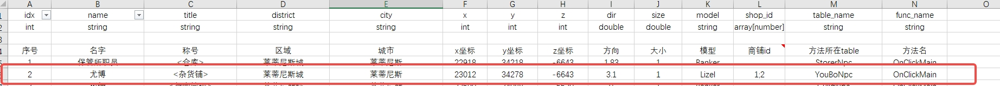

# 如何新增、修改Npc对话

## 在场景中添加Npc
- 1. 首先，在 `SceneServer\tools\Xlsx\kx_npc.xlsx` 中添加NPC配置。每个字段在配置表中都有详细介绍。配置完成后，生成Lua表配置。如图所示
- 
- 2.运行 `Xlsx2LuaTable.Mir2.exe` 生成Lua表配置。
- 3.在游戏中使用`/Reload`命令重新加载脚本，npc就会出现在场景中。
  
## 如何添加NPC对话
- 1.在 `kx_npc.xlsx` 配置中，`table_name` 与 `table_func` 字段需要在Lua脚本中添加对应的表和函数。当NPC被点击时，将触发对应的Lua函数。
```lua
---SceneServer\Scripts\npcs\尤博.lua
local m = {}

function m.OnClickMain(npc, player)
    local content = [[你好呀！%s 
    欢迎来到%s。作为这里的杂货铺老板，我可以为您提供各种各样
    的商品和服务，您需要什么帮助吗？
    ]]

    --Npc的选择项 使用|分割显示内容
    --与点击后触发的函数
    local select = {
        "我想要购买杂货|OnClickOpenShop",                           
        "取消|Exit"                                    
    }
    --格式化npc的对面内容
    content = string.format(content, player:Name(), npc:District())
    --当组装好npc对话内容后 调用npc的Say函数 传入 玩家对象 描述内容 选择内容 
    npc:Say(player, content, select)
end

-- 当玩家选择购买杂货时，调用 OnClickOpenShop 函数，并默认传入当前 NPC 对象和玩家对象
-- 如果当前 NPC 具有商店功能，您可以使用 npc 对象的 OpenShop() 函数，
-- 需要传入当前玩家对象和商店类型，商店类型与 kx_npc.xlsx 的 shop_id 字段相对应。
-- 商店的详细配置信息可以在 kx_shops.xlsx 中找到。
function m.OnClickOpenShop(npc, player)
    npc:OpenShop(player)
end

YouBoNpc = m
return m
```

- 2.NPC的简单功能就制作完成了。别忘了在 loadfile.txt 中添加脚本目录。