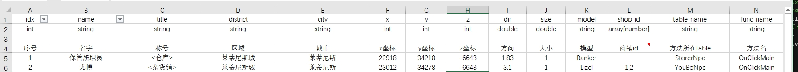

# 如何添加lua配置文件(数据配置)


## Excel配置表数据类型说明
在Excel配置表中，字段名和数据类型会影响生成的Lua脚本结构，以下是数据类型说明：
- int: 整型数值
- string: 字符串
- double: 双精度浮点型
- array[number]: 整型数组
- array[string]: 字符串数组
- #Desc: 使用#修饰字段名，程序不会解析此列数据到Lua中
## 创建数据表并生成Lua脚本
- 1. 打开 `SceneServer\tools\Xlsx\` 目录，这里存放着所有数据配置文件（如物品数据配置、技能数据配置等）。
- 2. 新建一个Excel表格，添加列表 idx、name等列，按照上述数据类型说明设置每一列的数据类型第一行为字段名，第二行为数据类型，第三行留空，第四行为字段注释，从第5行开始为正文内容。
- - 
- 3. 关闭所有Excel文件后，双击运行 `SceneServer\tools\Xlsx2LuaTable.Mir2.exe`，它会自动生成Lua表格并保存到 `SceneServer\table` 目录下。请注意不要直接修改生成后的Lua表格。
## 加载Lua脚本并使用数据
- 1. 在 `config_manager.lua` 文件中添加以下内容:
```lua
--SceneServer\Scripts\config\config_manager.lua 中部分示例代码
m.npcConfig = nil               --全局缓存
function m.GetNpcConfig()       --从硬盘加载数据并保存到m.npcConfig字段
    package.loaded["table\\kx_npc"] = nil 
    m.npcConfig = require("table\\kx_npc")
    return m.npcConfig
end
```
- 2. 您可以自行控制` GetNpcConfig()` 加载的生命周期，或将其添加到 `game_manager.lua` 的 `ScriptLoaded()` 函数中。这个函数在Lua脚本重新加载完成后触发一次（在游戏中管理员可以使用 `/Reload` 命令重新加载所有Lua脚本）。
```lua
-- SceneServer\Scripts\manager\game_manager.lua 中部分示例代码
function m.ScriptLoaded(game)
    LuaConfig.GetNpcConfig()
end
```
- 3.使用代码示例：
```lua
function m.OnClickNpc(npcIdx)
    local npcDB = LuaConfig.npcConfig[npcIdx]
    local npcName = npcDB.name
end
```

通过上述步骤，您可以创建并使用Lua配置文件，加载数据以及在代码中使用配置数据。请确保按照说明设置Excel表格、生成Lua脚本并正确加载数据，以便您的项目能够成功利用配置数据。
