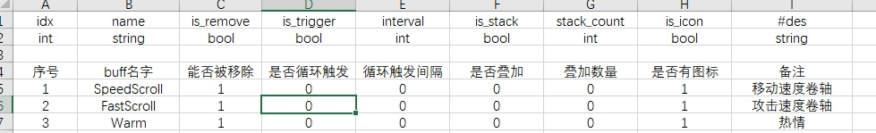

# 如何添加一个自定义Buff


## 添加Buff配置
- 1. 首先，在 `SceneServer\tools\Xlsx\kx_buff.xlsx` 中添加Buff配置。每个字段在配置表中都有详细介绍。配置完成后，生成Lua表配置。如图所示
- 
- 2.运行 `Xlsx2LuaTable.Mir2.exe` 生成Lua表配置。
- 3.在游戏中使用`/Reload`命令重新加载脚本，Buff配置就会加载到游戏内存中。

## 增加buff开始、持续、结束三个事件函数
```lua
--- SceneServer\Scripts\manager\buff_manager.lua 部分示例代码
--- OnBuffStart、OnBuffTriggered、OnBuffExpired 属于固定函数
--- _1：等于buff的idx序号

---移动速度卷轴Buff 开始
---@param player Player 玩家对象
---@param idx number buff idx
function m.OnBuffStart_1(player, idx, buffUid)
    --local buffConfig = LuaConfig.buffConfig[idx]
    --player:IncAttr(emBaseAttr.MoveSpeed, 1);
    --设置了临时变量 移动速度卷轴 的值为 30
    player:SetNumber("移动速度卷轴", 30, false)
    --显示的调用了重新计算玩家属性
    player:RefreshAttribute(false)
    --log(string.format("Player %s Use %s", player:Name(), buffConfig.name))
end

---移动速度卷轴Buff 持续触发
---@param player Player 玩家对象
---@param idx number buff idx
function m.OnBuffTriggered_1(player, idx, buffUid)
    
end

---移动速度卷轴Buff 到期触发
---@param player Player 玩家对象
---@param idx number buff idx
function m.OnBuffExpired_1(player, idx, buffUid)
    --local buffConfig = LuaConfig.buffConfig[idx]
    --player:SubAttr(emBaseAttr.MoveSpeed, 1);
    --设置了临时变量 移动速度卷轴 的值为 0
    player:SetNumber("移动速度卷轴", 0, false)
    --显示的调用了重新计算玩家属性
    player:RefreshAttribute(false)

    --log(string.format("Player %s buff %s end", player:Name(), buffConfig.name))
end

---在玩家重新计算属性的函数中调用了此方法
---移动速度卷轴Buff 刷新属性回调
---@param player Player
function m.OnBuffRefreshAttribute_1(player)
    ---获取到玩家的临时变量 移动速度卷轴 的值
    local val = player:GetNumber("移动速度卷轴", 0)
    --log("IncSpeed " .. val)
    --如果大于0 就将玩家的附加属性 增加此数值
    --特别说明 player:IncAttr 增加玩家附加属性 此函数只有在计算属性中修改有效
    if val > 0 then
        player:IncAttr(emBaseAttr.MoveSpeed, val);
    end
end