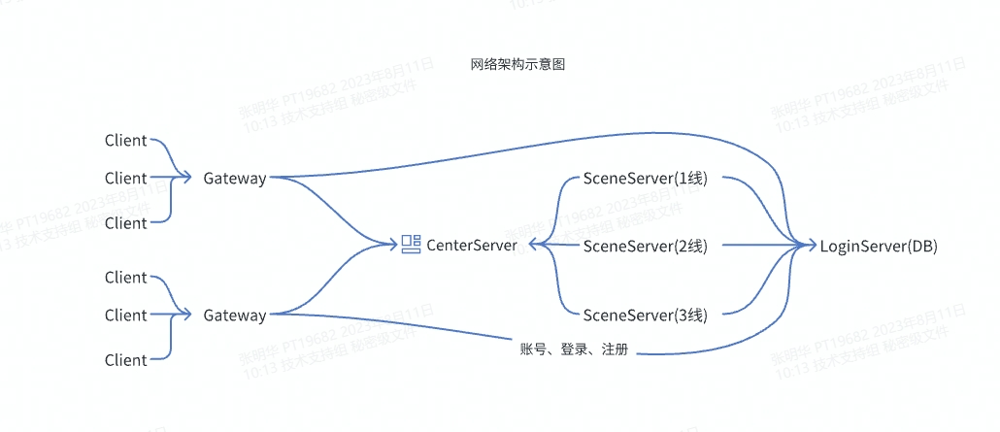

# EsayGame 项目文档

## 项目概述

EsayGame 是一个基于分布式多场景架构设计简单的游戏后端框架，

## 技术栈

- **游戏架构**：采用C++20自主研发的游戏后端框架
- **编程语言**：项目将使用 lua 作为主要的编程语言，与 C++ 紧密集成。
  
## 模块介绍

- **KxLogin**：采用.Net7编写的数据服务模块，主要功能：玩家登录、数据持久化等
- **KxGateway**：采用Go语言编写的分布式网关服务模块，主要功能：网络转发、封包、封挂处理等
- **CenterServer**：采用C++语言编写的游戏中心服务模块，主要功能：场景分发、聊天服务等
- **SceneServer**：采用C++语言编写的分布式场景服务模块，主要功能：核心逻辑处理、战斗处理等
- **KxLauncher**：采用.Net7语言编写的游戏登录器，主要功能：账号注册、游戏登录等

## 架构示意图
-    

## 快速开始

1. **克隆项目**：使用 Git 克隆 EsayGame 项目到本地：
   
2. **搭建数据库**：需要自主搭建Pg数据库，然后将连接字符串正确填写到配置文件 EsayGame\KxLogin\AppConfig\serverConfig.json。

3. **服务启动**：依次按启动 KxLogin.exe、KxCenterServer.Release.exe、KxStartup.Release.exe、KxGateway.exe。
   
4. **游戏启动**：将KxLauncher下的所有文件复制到客户端Bin目录下，双击KxLauncher.exe,选择服务器线路(朱雀区频道1)、注册账号(账号格式必须手机号格式)、登录游戏

## 疑难解答
- **SceneServer启动失败** 场景服务器需要KxLogin正确启动，并且连接上数据库后才能成功启动，如果启动不成功，可查看logs目录中的启动日志
  
## 开发文档(编辑中...)
-   [场景基础对象](./Doc/场景基础对象.md)
-   [场景玩家对象](./Doc/场景玩家对象.md)
-   [场景物品对象](./Doc/场景物品对象.md)
-   [如何搭建vscode开发环境](./Doc/如何搭建vscode开发环境.md)
-   [如何使用分布式网关、场景](./Doc/如何使用分布式网关、场景.md)
-   [如何添加lua配置文件(数据配置)](./Doc/如何添加lua配置文件(数据配置).md)
-   [如何添加使用道具触发](./Doc/如何添加使用道具触发.md)
-   [如何新增、修改Npc对话](./Doc/如何新增、修改Npc对话.md)
-   [如何添加玩家个人定时器](./Doc/如何添加玩家个人定时器.md)
-   [如何使用对象自定义变量](./Doc/如何使用对象自定义变量.md)
-   [如何添加一个自定义Buff](./Doc/如何添加一个自定义Buff.md)
## 贡献指南

欢迎所有对游戏开发感兴趣的人参与到 EsayGame 项目中来。如果您想要做出贡献，请遵循以下步骤：

1. 提交问题：如果您发现了 bug 或者有改进的建议，请先提交一个 issue 来讨论。
2. 创建分支：为了避免直接修改主分支，创建一个新的分支用于您的修改。
3. 提交变更：在您的分支上进行修改后，提交一个 pull request 来将您的修改合并到主分支中。
4. 团队审核：项目的维护者将对提交的变更进行审核，并根据需要提供反馈。
5. 合并变更：一旦变更通过审核，它将被合并到主分支中，并包含在后续的版本发布中。

## 联系我们

如有任何问题或建议，请联系我们：Q群906195109。